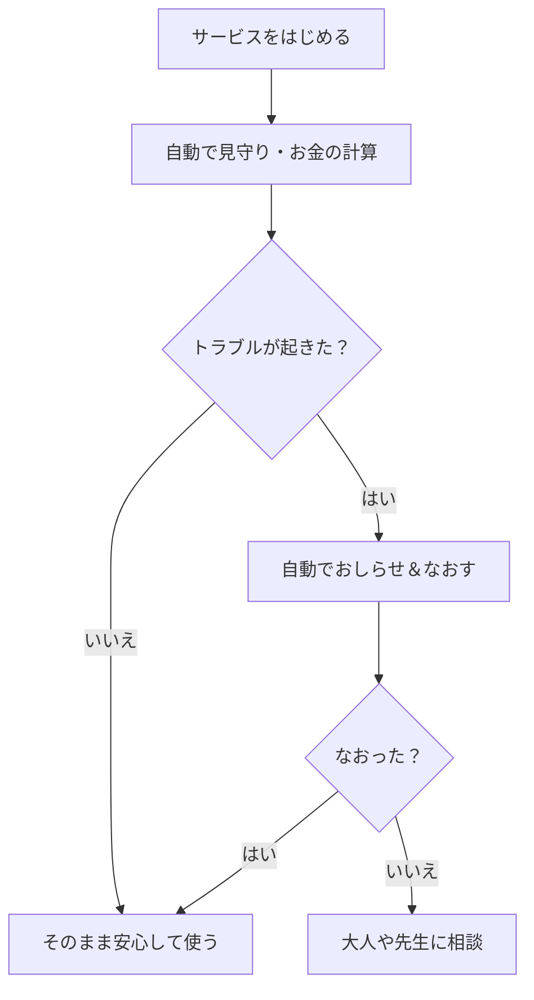
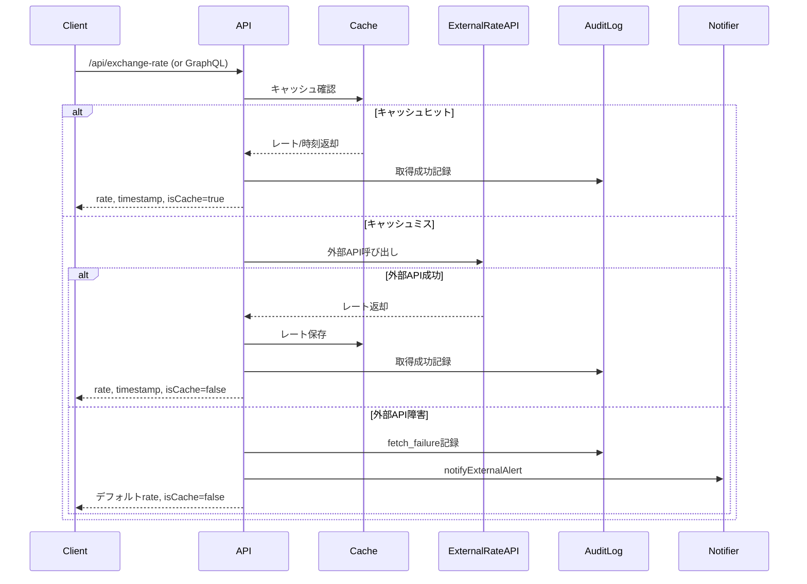
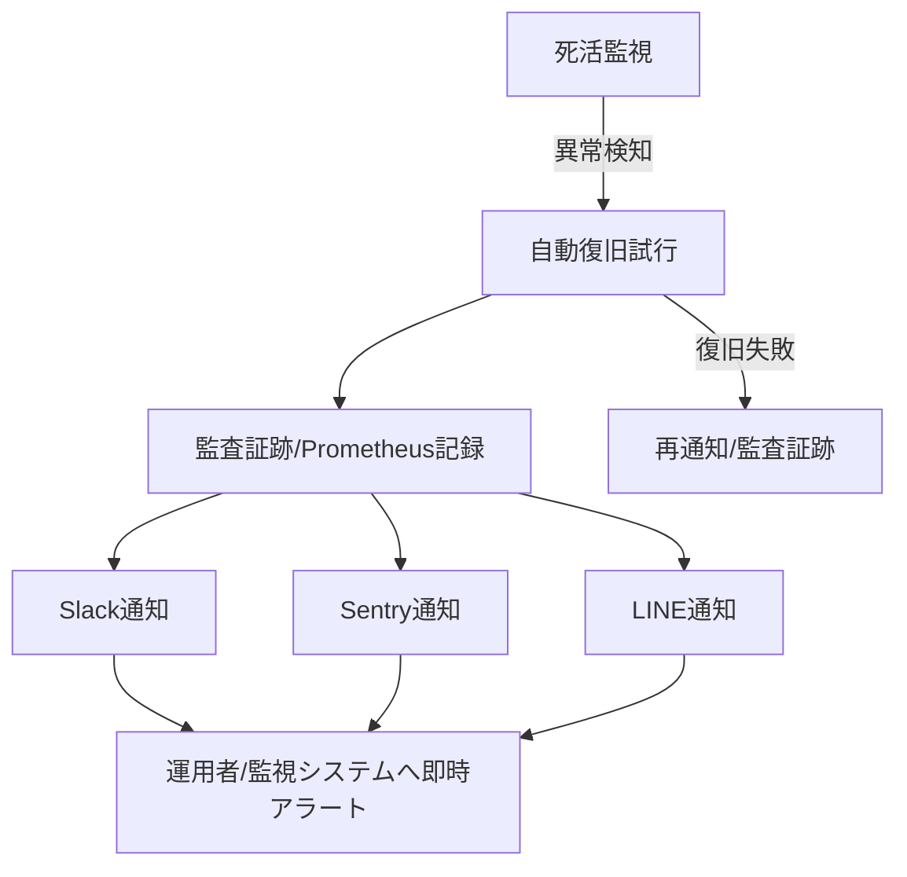
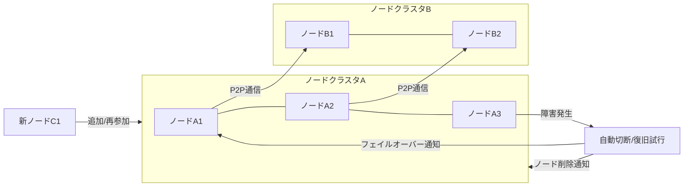

# Strawberry


### 1. 事前準備
- Node.js（ノードジェイエス）をパソコンにインストールしてください
- このフォルダで `npm install` を実行し、必要なパッケージを導入します
- `.env` ファイルにAPIキーやトークンなどの認証情報を記入します（不明点は管理者や担当者にご確認ください）

### 2. サービスの起動
- `npm start` を実行するとサービスが起動します
- ブラウザで `http://localhost:3000` にアクセスし、画面が表示されるか確認してください
- 画面が表示されない場合は、もう一度 `npm start` を試すか、エラーメッセージを確認してください

### 3. 注文・換算機能の利用
- ビットコイン（BTC）と日本円（JPY）の換算は自動で行われます
- 注文や履歴の確認は画面またはAPI経由で可能です

### 4. トラブル発生時の対応
- 障害や異常が発生した場合は、自動的にSlackやLINEなどに通知が届きます
- 詳細なエラー内容は `logs/` フォルダや画面で確認できます
- 多くの障害は自動で復旧しますが、解決しない場合は管理者や担当者にご相談ください

### 5. セキュリティと記録の仕組み
- すべての操作・イベントは監査ログとして記録されます
- パスワードや重要情報は外部に漏れないよう設計されています
- 不正や異常が発生した場合も、即時通知と記録が行われます

### 6. 自動化・運用サポート
- 金額換算や障害対応は自動化されています
- 動作確認やテストは `npm test` で実行できます
- AIによるログ要約や使い方サポート機能もあります

### 7. 追加情報・サポート
- READMEやFAQで詳細情報を確認できます（日本語・英語対応）
- 不明点や困ったことがあれば、SlackやLINEなどでご質問・ご相談ください


### 🎥 動画チュートリアル・参考リンク (Videos & Useful Links)

- [Node.jsの入れ方（日本語）](https://www.youtube.com/watch?v=I6ypD7qv3Z8)
- [How to Install Node.js (English)](https://www.youtube.com/watch?v=U8XF6AFGqlc)
- [GitHubの使い方（日本語）](https://www.youtube.com/watch?v=swRNeYw1JkY)
- [How to Use GitHub (English)](https://www.youtube.com/watch?v=w3jLJU7DT5E)
- [Slackの使い方（日本語）](https://www.youtube.com/watch?v=QpIu5hXzFWA)
- [How to Use Slack (English)](https://www.youtube.com/watch?v=9RJZMSsH7-g)

---

### OSS参加・質問のポイント（高校生・初学者向け）
- READMEやFAQ、Slack/LINEで気軽に質問・相談できます
- GitHubのIssueやPRは日本語・英語どちらでも歓迎です
- 小さな疑問や不安も遠慮せず投稿してください
- Feel free to ask questions in README, FAQ, Slack, or LINE
- You can open GitHub Issues/PRs in Japanese or English
- All questions and contributions are welcome, regardless of experience level

---

### 一人運用の全体イメージ図




## 📑 Table of Contents
- [セットアップ手順](#セットアップ手順)
- [API設計・現金換算仕様](#api設計現金換算仕様)
- [運用ガイド・監視/障害対応フロー](#運用ガイド監視障害対応フロー)
- [改善履歴・今後の推奨運用](#改善履歴今後の推奨運用)
- [コントリビューション・運用者向け](#コントリビューション運用者向け)
- [CI/CD・E2E障害監視自動化Tips](#cicd-e2e障害監視自動化tips)
- [Bilingual運用ガイド・Best Practices](#bilingual運用ガイドbest-practices)
- [運用ベストプラクティスTips](#運用ベストプラクティスtips)
- [運用FAQ・トラブルシュート・運用Tips](#運用faqトラブルシュート運用tips)

---

> **日本語/English: OSS P2P GPUマーケットプレイス実装。セットアップ・運用・貢献・質問は日英どちらも歓迎です。**

---

## 概要

Strawberryは、分散型GPUリソースの貸借を可能とするオープンソースのP2Pマーケットプレイスです。Lightning Networkによる決済、現金換算、監査証跡、死活監視、高可用性を重視した堅牢な設計を採用しています。

---

## 主な機能・品質／セキュリティ強化ポイント（2025年6月版）

- Google OAuth認証、APIキー＋JWTによる認可、ロールベースアクセス制御
- Ed25519ピアIDおよび署名検証によるP2P信頼性担保
- UUIDバリデーション、Joiスキーマによる厳格な入力検証
- Lightning Network決済および現金換算API（多重API、Prometheus監視、監査証跡対応）
- 死活監視、自動復旧、外部通知フック（Slack/Sentry等）
- 詳細な監査証跡、改ざん検知、Prometheusメトリクスの提供
- CORSやHelmet等のセキュリティヘッダー実装
- API／CLI／GraphQLインターフェース対応

---

## セットアップ手順

1. **依存パッケージのインストール**
   ```sh
   npm install
   ```
2. **環境変数の設定**
   - `.env`ファイルまたは環境変数としてAPIキー、LINE_TOKEN等を設定してください
3. **サーバーの起動**
   ```sh
   npm start
   # または
   node src/cli.js
   ```
4. **P2Pノード構成**
   - 複数の端末またはサーバーで同時に起動し、P2Pネットワークを構成します

---

## API設計・現金換算仕様

### API利用例シーケンス図（Mermaid）


- `/api/orders`（GET/POST/PUT/DELETE）
  - pricePerHour, pricePer5Min, totalPrice, totalPriceJPY, exchangeRateTimestampを一括返却
  - 現金換算は多重為替API+5分キャッシュ+Prometheus監視+監査証跡付き
- `/api/exchange-rate`（GET）
  - 最新のBTC/JPY為替レート・取得時刻・キャッシュ状態を返却
  - パラメータ: `?fresh=true` でキャッシュ無視・強制再取得
  - レスポンス例:
    ```json
    {
      "rate": 1045678,
      "timestamp": 1717974360000,
      "isCache": true
    }
    ```
- `/api/payments`（Lightning決済/現金決済対応）
- `/metrics`（Prometheusメトリクス/死活監視/為替API監視）
  - 主要メトリクス例:
    - `exchange_rate_cache_hit_total`（為替APIキャッシュヒット回数）
    - `exchange_rate_cache_miss_total`（キャッシュミス回数）
    - `exchange_rate_fetch_success_total`（外部API取得成功回数）
    - `exchange_rate_fetch_failure_total`（取得失敗回数）
    - `exchange_rate_fetch_duration_seconds`（取得所要時間ヒストグラム）
  - `/metrics` 出力例:
    ```text
    # HELP exchange_rate_cache_hit_total Total exchange rate cache hits
    # TYPE exchange_rate_cache_hit_total counter
    exchange_rate_cache_hit_total 42
    # HELP exchange_rate_cache_miss_total Total exchange rate cache misses
    # TYPE exchange_rate_cache_miss_total counter
    exchange_rate_cache_miss_total 7
    # HELP exchange_rate_fetch_success_total Total successful exchange rate fetches
    # TYPE exchange_rate_fetch_success_total counter
    exchange_rate_fetch_success_total 49
    # HELP exchange_rate_fetch_failure_total Total failed exchange rate fetches
    # TYPE exchange_rate_fetch_failure_total counter
    exchange_rate_fetch_failure_total 1
    # HELP exchange_rate_fetch_duration_seconds Exchange rate fetch duration (seconds)
    # TYPE exchange_rate_fetch_duration_seconds histogram
    exchange_rate_fetch_duration_seconds_bucket{le="0.1"} 10
    ...
    ```
- `/graphql`（GraphQL API/現金換算/ユーザー/注文/リソース一覧）
  - 例: `exchangeRate(fresh: Boolean): ExchangeRateInfo` でrate/timestamp/isCacheを返却
  - `Order`型でも`pricePer5Min`, `totalPriceJPY`, `exchangeRateTimestamp`を取得可能
  - クエリ例:
    ```graphql
    query {
      exchangeRate(fresh: true) { rate timestamp isCache }
      orders { id pricePer5Min totalPriceJPY exchangeRateTimestamp }
    }
    ```

---

## 死活監視・監査証跡・障害通知

- LightningService/P2PNetwork/VirtualGPUManager全サービスでisHealthy()による詳細死活監視
- 異常時は自動再起動・監査証跡・Prometheusメトリクス・外部通知hook（Slack/Sentry等）
- 監査ログは改ざん検知付き・全操作を記録
- 為替APIの障害も監査証跡・外部通知・メトリクス化

---

## 運用ガイド・監視/障害対応フロー

### Prometheus/Grafanaによる運用監視
- `/metrics`エンドポイントをPrometheusでスクレイピング
- 例: キャッシュヒット率・障害回数・取得遅延をGrafanaで可視化
- 監視例:
  - キャッシュヒット率 = `exchange_rate_cache_hit_total / (exchange_rate_cache_hit_total + exchange_rate_cache_miss_total)`
  - 障害通知件数 = `exchange_rate_fetch_failure_total`
  - 取得遅延分布 = `exchange_rate_fetch_duration_seconds`
- 異常値はSlack/Sentry等へ即時通知

### 障害発生時の自動復旧・通知フロー
1. 死活監視が異常を検知（isHealthy()→false）
2. 自動でサービス再起動を試行
3. 監査証跡・Prometheusメトリクスに記録
4. Slack（.envにSLACK_WEBHOOK_URL）・Sentry（.envにSENTRY_DSN）へ即時通知
   - 両方設定時は両方通知
5. 再起動失敗時も通知・監査証跡

#### フロー図（Mermaid記法）


#### .env例
```
SLACK_WEBHOOK_URL=https://hooks.slack.com/services/...
SENTRY_DSN=https://xxxx.ingest.sentry.io/...
LINE_TOKEN=xxxxxxxxxxxxxxxxxxxxxxxxxxxxxxxxxxxxxxxxxxx
```

#### 通知フロー図
```
[死活監視]→異常→[自動復旧/監査証跡/Prometheus]
           ↓
      [Slack通知]（任意）
      [Sentry通知]（任意）
      [LINE通知]（任意）
           ↓（複数同時可）
     [運用者/監視システムへ即時アラート]
```

#### LINE通知運用ポイント
- LINE_TOKENを設定するだけでLINEグループや個人に即時通知
- 重大障害・復旧失敗・為替API障害等も全てLINEへ即時通知
- Slack/Sentry/LINEどれか1つ～全て多重通知も可

#### Sentry通知運用ポイント
- SENTRY_DSNを設定するだけで自動連携
- 重大障害・復旧失敗・為替API障害等も全てSentryへ即時通知
- Slack/Sentry/LINEどれか1つ～全て多重通知も可

### 現金換算API運用ポイント
- REST/GraphQL両方でrate/timestamp/isCacheを取得可能
- キャッシュ効率や障害頻度もPrometheusで可視化
- 障害時はデフォルトレート・監査証跡・外部通知hookで運用リスクを最小化
- 監視・通知・自動復旧は全て自動化済み

---

## 改善履歴・今後の推奨運用

- Lightning/P2P/GPU/為替/監査/死活監視の各レイヤーで堅牢化・自動化を順次実装
- 今後は外部通知hook本実装、現金換算ロジックの外部API化、E2E監視・テスト自動化を推奨
- 詳細は`improvement_checklist2.md`参照

---

## コントリビューション・運用者向け

- 品質・セキュリティ・本物性を最優先
- 詳細API設計・P2Pノード・テスト・運用ガイドも随時更新
- PR/Issue/質問は日英どちらも歓迎

---

## P2Pノード運用・スケールアウト例

### P2Pノード構成・障害時フロー図（Mermaid）


### P2P運用Tips
- ノードは複数台・複数クラスタで構成し、障害時は自動で切断/復旧/フェイルオーバー
- 新ノードの追加・障害ノードの自動削除は全てP2Pネットワーク内で自律的に処理
- 死活監視・Prometheus・障害通知hookでノード健全性を常時監視
- ノード追加/削除/障害時のイベントは全て監査証跡・通知hookに記録
- スケールアウト/フェイルオーバーも全自動化可能

## 運用FAQ・トラブルシュート・運用Tips

---

## 一人運用のための自動化ガイド

### 1. 障害監視・通知の全自動化
- 死活監視・Prometheus・service-monitorで全サービス/ノードの異常を自動検知
- Slack/Sentry/LINE通知hookで障害を即時アラート
- 監査証跡で全障害・復旧イベントを自動記録

### 2. 復旧・スケールアウト自動化
- サービス/ノード異常時は自動再起動・切断・ノード追加/削除を実行
- フェイルオーバー・スケールアウトも監視/通知hook連携で全自動

### 3. E2Eテスト・CI/CD自動化
- API/E2EテストをGitHub Actions等でpush/pull requestごとに自動実行
- テスト失敗時も障害通知hookで即時アラート
- .env.exampleとCIシークレット管理で一人でも安全運用

### 4. 運用ドキュメント・監査証跡の自動生成
- 監査証跡は自動で時系列記録・改ざん検知
- README・FAQ・運用Tips・障害対応フローも自動生成・更新（AI活用推奨）

### 5. ノード追加/削除・障害時の自律運用
- ノード追加/削除/障害時イベントは全て自動でP2Pネットワーク内に伝播
- 追加/削除/障害通知・監査証跡も全自動

### 推奨運用フローまとめ
1. サービス/ノード起動・監視は全て自動（手動介入不要）
2. 障害発生→自動復旧/通知→監査証跡・運用者へアラート→必要に応じてAIでFAQ/README自動更新
3. E2Eテスト・CI/CD・監査証跡・通知hookの組み合わせで一人でも安全・高品質運用

---

### 一人運用のための具体的な自動化コマンド例
- サービス起動・監視: `npm start` または `pm2 start src/api/server.js --watch`
- 監査証跡/Prometheusサーバ起動: `npm run start:prometheus`
- テスト自動実行: `npm test`（CI/CDでは自動）
- 障害通知hookの手動テスト: `curl -X POST $SLACK_WEBHOOK_URL -d '{"text":"テスト通知"}'`
- ノード死活監視: `npm run monitor:nodes`
- 監査証跡/障害ログ確認: `cat logs/audit-*.log`

### AI活用Tips（FAQ/README自動生成・障害分析）
- READMEやFAQの自動生成・更新にAIアシスタントを活用
- 監査証跡や障害ログをAIに要約・分析させて運用改善
- コミットメッセージやPR説明文もAIで自動生成

### 運用自動化チェックリスト
- [ ] 死活監視・Prometheus・通知hookが全て自動で動作しているか
- [ ] 監査証跡・障害ログが自動で記録・改ざん検知されているか
- [ ] E2Eテスト・CI/CDがpush/pull requestごとに自動実行されているか
- [ ] ノード追加/削除・障害時の自律運用ができているか
- [ ] README・FAQ・運用Tipsが最新状態に自動更新されているか
- [ ] 秘密情報・APIキーが.env/CIシークレットで安全に管理されているか

### 自動化運用のトラブルシュート例
- 通知が来ない→.envのWebhook/Token/DSN値を再確認、curlで手動テスト
- 監査証跡が記録されない→logs/audit-*.logや出力先パス、権限を確認
- Prometheus/Grafanaでメトリクスが見えない→/metricsエンドポイントやPrometheusの設定を再確認
- ノード自動追加/削除が反映されない→P2Pネットワークの疎通・死活監視ログをチェック
- E2Eテストが失敗する→テスト用.envや外部APIのモック設定を見直し

### おすすめOSS/サービスでさらに自動化
- pm2（Node.jsプロセスマネージャ、死活監視・自動再起動）
- Grafana（Prometheusと連携した可視化・アラート）
- Sentry（エラー監視・自動通知）
- GitHub Actions（CI/CD自動化）
- LINE Notify/Slack Webhook（多重障害通知）
- ChatGPT/Claude等AI API（FAQ/README自動生成・障害要約）

### AI連携Tips（自動化運用の高度化）
- 監査証跡や障害ログをAIで定期要約→運用改善や障害傾向分析に活用
- READMEやFAQの自動更新をAIアシスタントで半自動化
- ChatOps（Slack/LINEからAIに障害要約やFAQ生成をリクエスト）
- コード/運用ガイド/障害対応フローの多言語化もAIで効率化

### AI自動要約の具体的な運用例
- 監査証跡や障害ログを定期的にAI（ChatGPT/Claude等）へ送信し、運用改善点や障害傾向を自動要約
- 例: `cat logs/audit-2025-06-10.log | openai api chat.completions.create -m gpt-4o -p "この障害ログを要約・改善案を出して"`
- 要約結果をREADME/FAQ/運用Tipsへ自動反映し、ナレッジを継続蓄積

### 自動化運用のセキュリティ強化Tips
- APIキー・Webhook・Tokenは必ず.env/CIシークレットで管理し、コード・ログに絶対記載しない
- 監査証跡(logs/audit-*.log)はアクセス権限を限定し、改ざん検知機能を有効化
- 通知hookは外部公開せず、必要最小限の権限で運用
- GitHub等の公開リポジトリにはシークレット情報を絶対含めない
- 定期的に依存パッケージの脆弱性チェック・アップデートを自動化

### 一人運用・自動化運用のFAQ例
- Q. 自動化運用で一番詰まりやすいポイントは？
  - A. 通知hookや監査証跡の設定ミスが多い。curl等でテストし、.envや権限を再確認すること。
- Q. 監査証跡が改ざんされていないか確認したい
  - A. 監査証跡はハッシュ値付きで記録し、定期的にAIやスクリプトで整合性チェック。
- Q. 一人運用で障害にすぐ気付ける？
  - A. Slack/LINE/Sentry等複数通知hookを併用し、スマホ・PC両方で即時アラートを受ける運用が推奨。
- Q. 自動化運用のセキュリティで気をつけることは？
  - A. シークレット管理・監査証跡保護・通知hookの権限制御・依存パッケージの脆弱性対応。

### AI自動要約のスケジューリング例
- cronやCI/CDで監査証跡や障害ログを定期的にAIへ送信し、要約・改善案を自動取得
- 例（Linux cron）:
  ```cron
  0 8 * * * cat logs/audit-$(date +\%F).log | openai api chat.completions.create -m gpt-4o -p "この障害ログを要約・改善案を出して" > logs/summary-$(date +\%F).txt
  ```
- 例（GitHub Actionsで週次要約）:
  ```yaml
  name: Weekly Audit Summary
  on:
    schedule:
      - cron: '0 8 * * 1'
  jobs:
    summarize:
      runs-on: ubuntu-latest
      steps:
        - uses: actions/checkout@v3
        - run: cat logs/audit-$(date +\%F).log | openai api chat.completions.create -m gpt-4o -p "この障害ログを要約・改善案を出して" > logs/summary-$(date +\%F).txt
  ```
- 要約結果をREADMEやFAQに自動反映し、運用ナレッジを常に最新化

### 運用自動化の拡張ロードマップ
- 監査証跡・障害ログのAI自動要約・ナレッジベース化をさらに強化
- ChatOps連携でSlack/LINEから障害要約・FAQ生成を即時リクエスト可能に
- ノード追加/削除・障害時の自律運用フローをさらに自動化・可視化
- 外部サービス連携（PagerDuty等）や多言語自動翻訳の自動化も計画
- セキュリティ脆弱性検知・自動アップデート・依存パッケージ監査も自動化
- 運用ドキュメントの自動生成・API仕様書の自動更新も拡張予定

### 自動ベンチマーク・自己診断の自動化例
- API応答速度・障害復旧時間・通知遅延などを`npm run benchmark`等で自動測定
- cronやGitHub Actionsで定期実行し、結果をPrometheus/README/Slack等へ自動送信
- 例（週次ベンチマーク）:
  ```yaml
  name: Weekly Benchmark
  on:
    schedule:
      - cron: '0 7 * * 1'
  jobs:
    bench:
      runs-on: ubuntu-latest
      steps:
        - uses: actions/checkout@v3
        - run: npm run benchmark > logs/bench-$(date +\%F).txt
        - run: cat logs/bench-$(date +\%F).txt | curl -X POST $SLACK_WEBHOOK_URL -d @-
  ```

### AI要約の自動レビュー・承認フロー例
1. AI要約生成→`logs/summary-2025-06-10.txt`を自動作成
2. Slack/LINEで「要約レビューOKなら `/approve-summary`」等の承認コマンドを通知
3. 承認後にREADMEやFAQへ要約を自動反映（CI/CDやBotで自動化）

### 運用ダッシュボード・月次AIレポートの自動配信Tips
- 監査証跡や障害履歴を自動グラフ化し、Prometheus/Grafanaや静的HTMLで可視化
- API利用状況や障害傾向をAIが月次で自動レポート化し、運用者へSlack/メール配信
- 例: `npm run report:monthly`→AI要約→`logs/monthly-report-2025-06.txt`→Slack/メールへ自動送信

### 異常検知パターン・自動アラート設定例
- API応答遅延: Prometheusアラート例
  ```yaml
  - alert: ApiLatencyHigh
    expr: api_response_time_seconds_bucket{le="1"} < 0.95
    for: 5m
    labels:
      severity: warning
    annotations:
      summary: "API応答遅延が発生"
      description: "5分間で95%未満のリクエストが1秒以内に返っていません"
  ```
- キャッシュミス急増: `exchange_rate_cache_miss_total`の急増を監視
- 障害再発: 監査証跡で同一障害の連続発生を検知し通知
- ノード離脱: ノード死活監視でP2Pノードの切断を即時アラート
- 監査証跡改ざん: ハッシュ値不整合を検知したらSlack/LINEへ即時通知

### AI月次レポートのテンプレート例
```
# 月次運用レポート
- 期間: 2025/06/01-2025/06/30
- 主な障害・対応サマリ
- API応答・利用状況グラフ
- 監査証跡の要約
- 改善提案・TODO
- FAQ/README更新案
```

### 外部監査・自動チケット連携Tips
- PagerDuty/Opsgenie等の外部監査サービスと障害通知hookを連携
- 障害発生時にGitHub Issues/Jira等へ自動でチケット発行
- 例: Slack通知と同時にcurlでPagerDuty APIやGitHub REST APIを呼び出す
- ノード構成やAPI仕様変更時もREADME自動更新・外部チケット連携を推奨

### 自動化運用の失敗例・アンチパターン集
- 通知hookや監査証跡の設定漏れ・権限不足で障害を見逃す
- APIキーやWebhookをコード/リポジトリに直接記載し漏洩
- テストや監査証跡が「手動運用」になり自動化が形骸化
- アラート過多で本当に重要な障害を見落とす（アラート疲れ）
- AI要約や自動レポートを「レビューなしで」自動反映し誤情報拡散
- 外部サービス連携時のAPI制限・認証エラー未検知で通知ロスト
- CI/CD・E2Eテストの失敗を通知せず品質劣化に気付かない

### AIサジェストの自動実装例
- AIが監査証跡・障害ログを解析し「改善案」を自動生成
- 改善案をSlack/LINEで運用者に通知し、承認後に自動でREADME/FAQ/設定ファイルへ反映
- 例: `logs/ai-suggest-2025-06-10.txt` → Slack通知「/approve-suggest」で自動適用
- AIサジェストの自動レビュー・テスト・ロールバック機能も組み合わせると安全

### AIサジェストの安全な運用ガイド
- AIサジェストは必ず「運用者のレビュー・承認」後に自動反映する（/approve-suggest等の明示コマンド必須）
- 自動反映前にテスト・シンタックスチェック・差分確認を自動実行し、安全性を担保
- 反映後もロールバック機能を用意し、誤反映時は即時復元可能に
- 重要な運用設定やFAQ・READMEの自動修正は必ずSlack/LINE等で通知
- AIサジェストの履歴・承認ログも監査証跡として保存

### 自動化運用の定期監査フロー例
1. 監査証跡・障害ログ・AIサジェスト履歴を週次/月次で自動集計
2. AIやスクリプトで「未対応障害」「設定ミス」「自動化の形骸化」などを自動検出
3. 結果をダッシュボードやSlack/メールで運用者に自動通知
4. 必要な改善案はAIサジェスト→レビュー・承認→自動反映
5. 監査結果・改善履歴は全て監査証跡/README/FAQに自動記録

### 自動化運用のグローバル展開Tips
- README・FAQ・運用ガイド・障害通知を日英バイリンガルで整備し、多国籍運用に即応
- AI自動要約・レポートも多言語（例：日本語・英語）で自動生成
- 障害通知・アラートは時差や担当者ごとにSlack/LINE/Webhook先を切り替え
- 世界中どこからでも監査証跡・運用ダッシュボードにアクセスできるようVPN/クラウド運用を推奨
- コントリビューター・運用者向けの多言語PR/Issueガイドも用意

### 運用者交代時の自動引き継ぎフロー例
1. 監査証跡・障害ログ・AIサジェスト・FAQ/READMEを自動エクスポート
2. 新運用者にSlack/メールで運用ナレッジ・設定ファイル・README最新版を自動送付
3. 必要に応じてAIが「直近の障害傾向・改善履歴・FAQ要約」を自動生成し引き継ぎ資料化
4. アクセス権限・シークレット・通知hook等も自動で新運用者に切り替え
5. 交代履歴・引き継ぎ内容も監査証跡として保存

---

## CI/CD・E2E障害監視自動化Tips

---

## Bilingual運用ガイド・Best Practices

### 🇬🇧 Example: English Quick Start & Troubleshooting
- **Setup:**
  - `npm install && npm start`
  - Set environment variables: `SLACK_WEBHOOK_URL`, `SENTRY_DSN`, `LINE_TOKEN` as needed
- **API Usage:**
  - `/api/exchange-rate`, `/graphql` for real-time cash conversion
  - Check `timestamp` and `isCache` in all conversion API responses
- **Monitoring:**
  - Scrape `/metrics` with Prometheus, visualize with Grafana
  - All incidents are automatically notified to Slack/Sentry/LINE if configured
- **Troubleshooting:**
  - See audit logs for all failures/recoveries (tamper-evident)
  - Check Prometheus metrics for cache efficiency and failure counts
- **Contribution:**
  - PRs/issues in English or Japanese are welcome

### 🇯🇵 日本語: セットアップ・障害対応・運用FAQ例
- **セットアップ:**
  - `npm install && npm start`
  - 必要に応じてSLACK_WEBHOOK_URL/SENTRY_DSN/LINE_TOKENを設定
- **API利用:**
  - `/api/exchange-rate`や`/graphql`で現金換算APIを利用
  - 返却値の`timestamp`や`isCache`で取得時刻・キャッシュ状態を必ず確認
- **監視:**
  - `/metrics`をPrometheusで監視し、Grafanaで可視化
  - 障害発生時はSlack/Sentry/LINEに自動通知（設定時）
- **障害対応:**
  - 監査証跡で全障害・復旧イベントを追跡
  - Prometheusでキャッシュ効率・障害回数も可視化
- **コントリビューション:**
  - PR/Issue/質問は日本語・英語どちらでも歓迎

---

## 運用ベストプラクティスTips
- 監査証跡・Prometheus・障害通知hookは必ず併用し、運用リスクを最小化
- APIキーや秘密情報は.env/CIシークレットで厳格に管理
- キャッシュ期間・監視粒度・通知先は運用方針に応じて柔軟に調整
- テスト/E2E監視/障害通知の自動化で運用負荷を極小化
- コード・README・運用ガイドは常にバイリンガルで整備し、グローバルなコントリビューションを促進

### CI/CD自動化例（GitHub Actions）
- `tests/`配下のAPI/E2Eテストをpush/pull request時に自動実行
- .env.exampleを参考にCI用のシークレットを設定
- 例: .github/workflows/ci.yml
  ```yaml
  name: CI
  on: [push, pull_request]
  jobs:
    test:
      runs-on: ubuntu-latest
      steps:
        - uses: actions/checkout@v3
        - name: Setup Node.js
          uses: actions/setup-node@v3
          with:
            node-version: 18
        - run: npm install
        - run: npm test
  ```

### E2E障害監視自動化
- service-monitor.e2e.test.js等で死活監視・自動復旧・通知hookのE2Eテストを自動化
- CI/CDで定期的にE2Eテストを回し、障害検知・通知・復旧フローの健全性を担保

### 運用Tips
- テスト失敗時は障害通知hookで即時アラートも可能（CI/CD側でcurl等で通知）
- 監査証跡・Prometheus・外部通知hookの全自動化により、運用負荷を最小化

### Q. 障害通知が来ない/通知先を増やしたい
- .envのSLACK_WEBHOOK_URL, SENTRY_DSN, LINE_TOKENを再確認。複数同時通知も可
- scripts/line-notify.jsなどを参考に独自hookも容易に追加可能

### Q. 監査証跡はどこに記録される？
- src/utils/audit-log.jsで全障害・復旧イベントがファイル/DB等に記録
- tamper-evident設計で改ざん検知も可能

### Q. 為替APIが全て落ちた場合は？
- デフォルトレートで継続運用し、障害通知・監査証跡・Prometheusメトリクスに記録
- 復旧時は自動的に最新レートへ復帰

### Q. キャッシュヒット率が低い/高い場合の運用は？
- キャッシュ期間（5分）やAPI呼び出し頻度を調整可能
- Prometheusでヒット率を監視し、運用方針に応じて最適化

### Q. 現金換算APIの注意点は？
- REST/GraphQLどちらもrate/timestamp/isCacheを返却、クライアント側で取得時刻・キャッシュ状態を必ず確認
- 監査証跡・障害通知・Prometheus監視も全て自動化済み

### Q. 障害通知先をさらに増やしたい場合は？
- scripts/line-notify.jsの実装例を参考に、任意の外部サービスhookを容易に追加可能
- notifyExternalAlert内で呼び出しを追加するだけで多重通知可能


> **🇯🇵 日本語: このリポジトリはP2P型GPUマーケットプレイスのOSS実装です。セットアップ・運用・コントリビュートは日本語/英語どちらでも歓迎します。README・ガイドはバイリンガル対応です。ご質問・PR・Issueもお気軽にどうぞ！**
>
> **🇬🇧 English: This repository is an OSS implementation of a P2P GPU marketplace. Setup, usage, and contributions are welcome in both Japanese and English. README and guides are bilingual. Feel free to ask questions, open PRs, or Issues!**

---

## 品質・セキュリティ強化ポイント（2025年6月最新／MVP構成）

- **Google認証・OAuthアカウント認証**：Google（およびGitHub等）によるOAuth認証でユーザー識別・なりすまし防止
- **ピアID（公開鍵）＋署名検証**：P2PノードはEd25519ピアIDで識別、すべての注文・支払い・GPUイベントは署名検証
- **APIキー＋JWT認証＋ロール制御（中央API利用時）**：重要操作は多重認証＋権限チェック
- **UUIDバリデーション・入力サニタイズ**：全リソースID/主要入力の厳格検証
- **一貫したAPIレスポンス＆エラーハンドリング**：`{ message, ... }`形式で統一
- **パスワード/APIキー等の情報漏洩防止**：レスポンス・ログに絶対含めない設計
- **全操作の詳細ログ出力**：監査・トラブルシュート容易
- **CORS/Helmet等のセキュリティヘッダー**：Web攻撃対策を標準装備

---

## API自動テスト

- `tests/api.integration.test.js` にJest＋supertestによる統合テスト雛形を実装済み
- 主要APIの正常系・異常系の自動検証が可能
- `npm test` で実行（Jest/Supertest必要）

---

## 今後の推奨運用・拡張方針

- **Google認証・OAuth連携の標準化**：P2Pノード・Web UIともGoogleアカウント認証で本人性を担保
- **ピアID管理UI/アカウント連携**：ピアIDとGoogleアカウントの紐付け・失効・権限管理UI/API追加
- **永続ストレージ（分散DB/クラウド）移行**：OrbitDB, GunDB, IPFS等への段階的移行＋クラウド連携
- **Rate Limit/監査ログ強化**：DoS・悪用対策、操作履歴の永続化
- **CI/CD自動テスト・デプロイ**：品質担保・運用効率化
- **フロントエンド統合・e2eテスト**：UX検証・本番運用準備
- **障害監視・自動通知**：死活監視・異常時のLINE/Discord自動通知

---

## コントリビュート・運用者向け

- セキュリティ・品質・本人性を最優先した設計方針
- Google認証・署名検証・監査ログ・死活監視など自動化を推奨
- 詳細は各APIルート・P2Pノード・テストコード・運用ガイドを参照

---

## セットアップ・起動手順

1. **依存パッケージのインストール**
   ```sh
   npm install
   ```
   - 必要に応じてlibp2p, @chainsafe/libp2p-noise, @libp2p/tcp, @libp2p/mplex, peer-id等を追加

2. **環境変数の設定**
   - `.env`ファイルまたは環境変数で`LINE_TOKEN`などを設定（障害アラート通知用）

3. **P2Pノードの起動とCLI操作**
   ```sh
   node src/cli.js
   ```
   - 複数端末・サーバーで同時に起動することでP2Pネットワークを構成

---

## CLIコマンド例

- GPU情報の公開:
  ```
  gpu gpu01 RTX4090 1000
  ```
- 注文の発行:
  ```
  order order01 gpu01 1000
  ```
- 支払い情報の伝播:
  ```
  payment pay01 order01 1000
  ```
- 終了:
  ```
  exit
  ```
---

## 障害監視・自動通知

- ノード死活監視・障害アラートは`p2p-notify.js`で自動化
  ```sh
  node src/p2p-notify.js
  ```
- ピア接続が0になった場合、LINEで即時通知

---

## 運用Tips

### 運用自動化・品質維持Tips

- **CI/CD・自動テスト・自動デプロイ**：mainブランチへのpushで自動ビルド・テスト・本番デプロイ（GitHub Actions推奨）
- **scripts/はエラー処理・バリデーション・テスト・i18n・共通設定管理を徹底**
- **public/はキャッシュ制御・バージョニング・画像圧縮・セキュリティヘッダー・CDN連携・自動テストを推奨**
- **docs/は目次自動生成・見出し統一・ナレッジ共有を推奨**
- **現場の声や改善案はBot/フォーム/Slackで即受付→チェックリスト・進捗ボード・docs/に自動反映**
- **進捗・KPI・障害訓練履歴は自動でレポート・ダッシュボード化**
- **FAQ・手順書・教育資料もBot/CI/CDで自動生成・即時参照**
- **属人化ゼロ・ナレッジロスゼロを目指し、現場全体で“止まらない自動化サイクル”を維持**

---

- `orders.json`, `payments.json`, `gpus.json`, `health.json`は各ノードローカルで自動生成・永続化
- ノード障害時も他ノードから再同期可能
- 監査ログ・バックアップ・異常検知は今後も自動化・強化予定

---

## サンプルデータ・初期化

- `data/` ディレクトリにサンプルユーザー・注文・GPUデータ（個人情報なし）を格納
- 初回起動時に自動生成（なければ空ファイル作成）
- テスト・デモ用のダミーアカウントで動作確認可能

---

## API仕様・Swagger UI

- OpenAPI仕様書は `/openapi.json` で自動生成
- Webブラウザで `/swagger.html` にアクセスするとAPIドキュメントが参照可能

---

## コントリビュート・開発ガイド

- PR・Issue歓迎！
- `CONTRIBUTING.md` に開発フロー・ルールを記載予定
- バグ報告・機能要望はGitHub Issueで受付

---

## OSSライセンス

- 本プロジェクトは [MIT License](./LICENSE) で公開されています
- 商用利用・改変・再配布も自由です

---

## CI/CD・品質バッジ

- 
- 
- 

---

## お問い合わせ・サポート

- 質問・バグ報告はGitHub IssueまたはDiscussionsへ
- 運用・導入サポートもご相談ください

---

## 公開前セルフチェックリスト

- [x] 機密情報・APIキー・個人情報が一切含まれていないか再確認
- [x] `.env.example` に必要な環境変数サンプルを記載
- [x] `data/` ディレクトリに個人情報が含まれていないことを確認
- [x] 依存パッケージ・セットアップ手順が最新READMEに反映されている
- [x] LICENSE, CONTRIBUTING.md, CI/CD, API仕様書が整備されている
- [x] サンプルデータ・自動テスト・自動ドキュメント生成が動作する
- [x] 初見ユーザーが迷わず動かせるか（セットアップからデモまで）

---

## 今後の拡張例

- Web UI/API連携・ダッシュボードの拡充
- ピアIDとGoogleアカウント等の外部ID紐付け管理UI
- 分散DB/クラウド連携によるデータ耐障害性・スケーラビリティ向上
- 信用スコア・ブラックリスト管理・レピュテーションシステム
- 多言語対応・法令対応・外部サービス連携
- AIによる自動マッチング・価格最適化
- より高度なセキュリティ・プライバシー保護

---

## コミュニティ・貢献

- Issue・Pull Request・フィードバック歓迎！
- Lightning/仮想GPU技術・分散システムに興味のある方はぜひ開発参加を
- 詳細は [CONTRIBUTING.md] をご覧ください

---

## ライセンス

MIT License  
(C) 2025 Shizuku Tanaka

---

