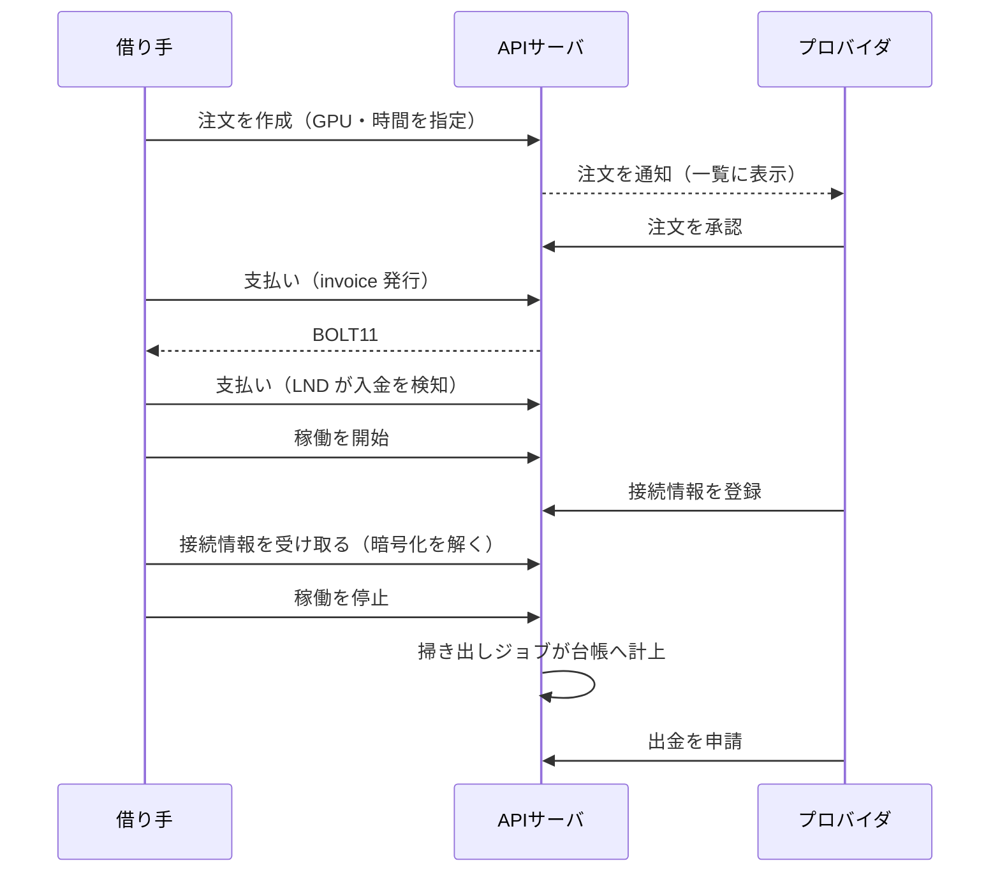
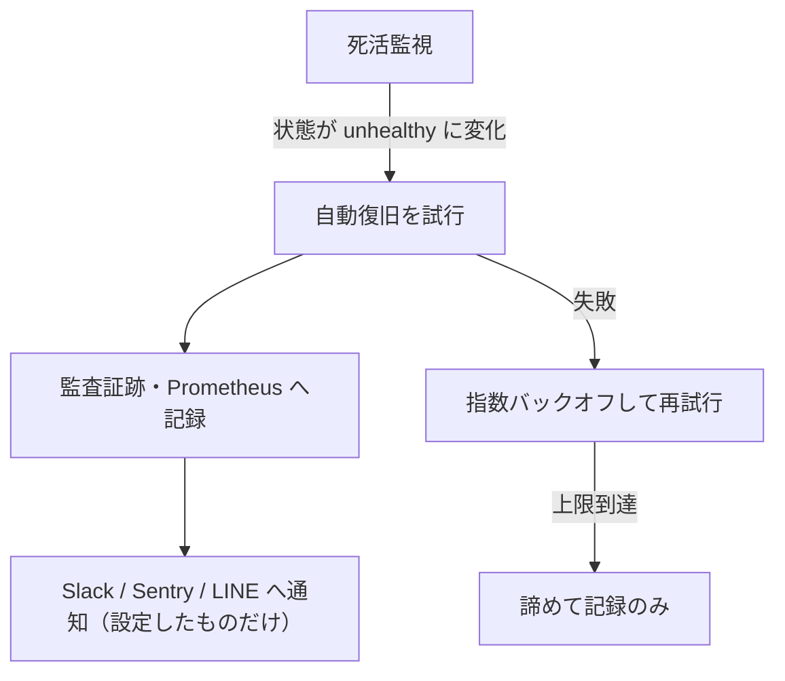

# Strawberry

GPU マーケットプレイス。GPU を持っている人が空き時間を貸し出し、計算資源が要る人が
借りて、Bitcoin / 銀行振込で精算する。

**運営者が仲介する（カストディアル）設計です。** 借り手の支払いはいったん運営に着金し、
運営がプロバイダへ送金します。接続情報も運営のサーバが暗号化して預かり、支払い済みの
借り手にだけ渡します。係争は運営が裁定し、レピュテーションと台帳も運営が保持します。
つまり**利用者は運営を信頼する必要があります**。以前 README は本製品を「P2P」「分散型」と
称していましたが、価値のやり取りに関わる機能はすべて中央のサーバが担っており、実態と
異なる説明でした（P2P レイヤのコードは読み込みにすら失敗する状態のまま放置されていたので
削除しました）。

> **状態に関する注記**: 2026-09 に README を実態へ合わせて整理しました（下記
> 「この README について」）。それでも仕様書が実装に先行することはあるので、
> リポジトリの**実態・既知の制約**は
> [`ARCHITECTURE.md`](./ARCHITECTURE.md) を一次情報として参照してください。

## クイックスタート（実際に動く手順）

```bash
npm ci
npm start          # http://localhost:3000
```

ブラウザで開くと、登録 → GPU出品/検索 → 注文 → 決済 → 稼働 → 停止 → レビューまで画面から
一通り操作できます。`.env` は無くても開発用の一時鍵で起動します（**本番では必須**。
`.env.example` 参照）。

検証:

```bash
npm test           # Jest（単体・API・セキュリティ）
npm run test:e2e   # Playwright（実ブラウザでの全行程）
npm run setup      # npm ci → OpenAPI生成 → テスト
```

### 借り手が実際に GPU へ接続するまで

このプロダクトの中心は「借りた GPU に接続できること」です。サーバは他人のマシンに権限を
持たないため、**接続手段を用意できるのは GPU を持っているプロバイダだけ**です。したがって:

1. 借り手が注文し、プロバイダが承認し、借り手が支払う
2. 借り手が開始する（`/start`）
3. **プロバイダが注文画面から接続情報（ホスト:ポート・ユーザー名・鍵/パスワード）を登録する**
4. 支払い済みの借り手だけが、稼働中のあいだそれを閲覧できる（終了時に破棄される）

認証情報は AES-256-GCM で暗号化して保存され、その注文の借り手以外には（プロバイダ本人にも）
復号して返しません。詳細は `ARCHITECTURE.md`「GPU アクセスの受け渡し」。

### GPU を貸しに出すのに必要なもの

出品で必須なのは、手元を見れば分かる 5 項目だけです。

- GPU 名 / ベンダー / モデル / メモリ(GB) / 時間単価(sats)

APIタイプ・アーキテクチャ・消費電力はサーバが機種から補います（RTX 4090 なら 450W、
といった公称値）。補った値は一覧・詳細で「推定」と表示され、出品者が申告した値とは
区別されます。参照表に無い機種の消費電力は**推測せず未設定のまま**にします
（推測値を保存すると、炭素排出量の推定や性能の水増し検出がその数字の上に乗ってしまうため）。
ドライババージョン・OS・クロックは表示専用なので任意です。

### プロバイダが実際に受け取るまで

借り手が払った sats は、いったん運営のノードに着金します（カストディアル）。そこから
プロバイダへ渡る流れは次のとおりです。

1. 注文が完了すると、5 分ごとの掃き出しジョブが**実提供量に応じて**台帳へ計上する
   （プロバイダの取り分 ＝ 課金額 − 運営手数料、未提供分は借り手への返金として計上）
2. プロバイダは「収益」画面で**受取可能残高**を見る
   （注文の値段の合計とは別物として表示される。手数料・未払い・返金を差し引いた後の額）
3. 残高の範囲で出金を申請する。送金先は事前に登録した `payoutAddress` のみで、
   リクエストの中身では上書きできない
4. 運営が実際に送金し、その**取引 ID を記録**して初めて「送金済み」になる

注文が完了せずに終わった場合も同じ台帳に載ります。係争が借り手勝ちで解決したとき、
マッチしたまま期限切れになったとき、借り手がキャンセルしたとき、プロバイダが断ったときは、
**支払い済みの金額が全額そのまま借り手の残高になります**（運営手数料も最低課金も引きません）。
稼働中に時間切れになった注文だけは、提供された時間分を按分します。

**送金そのものは自動化していません。** LN ノードを持たないまま「自動送金済み」と記録すると、
台帳と現実が食い違ったまま帳尻だけ合ってしまいます。運営が送らなければ資金は動きません
（＝運営への信頼が要る設計です）。計上は注文 ID 単位で冪等なので、掃き出しが何度走っても
二重計上・二重払いにはなりません。

## この README について（2026-09 の整理）

925 行のうち、**約 4 割が製品の説明ではありませんでした**。「AI 月次レポート」「ノード
追加/削除の自律運用」「PagerDuty/Jira への自動チケット発行」「グローバル展開 Tips」など、
どのプロジェクトにも当てはまる一般論か、この製品に無い機能の説明です。加えて:

- `node src/cli.js` / `node src/p2p-notify.js` … どちらもファイルが**存在しない**
- `npm run start:prometheus` は**存在しない**、`npm run monitor:nodes` も**存在しない**、
  `npm run report:monthly` も**存在しない**（package.json に 1 つも無い）
- 「ノード障害時も他ノードから再同期可能」「スケールアウト自動化」
  … 単一サーバ構成であることを同じ README の別の場所が書いています
- セットアップ手順が 3 回、コントリビュート案内が 3 回、運用 Tips が 2 回

手順どおりに叩いた人には「動かない」としか分かりません。実在しないものの説明を消し、
重複を畳みました。`npm run ...` が実在することは
`tests/docs/docs-match-code.test.js` が機械的に確かめます。

---

## 目次

- [概要](#概要)
- [できること・できないこと](#できることできないこと)
- [セットアップ](#セットアップ)
- [API](#api)
- [監視・監査証跡・障害通知](#監視監査証跡障害通知)
- [運用 FAQ](#運用-faq)
- [テスト](#テスト)
- [ドキュメント](#ドキュメント)
- [はじめての人へ](#はじめての人へ)
- [コントリビュート・ライセンス](#コントリビュートライセンス)

---

## 概要

GPU リソースの貸借を仲介するオープンソースのマーケットプレイスです。Lightning Network に
よる決済、円換算、監査証跡、死活監視を備えます。**運営者が資金と接続情報を預かる
カストディアル設計**であり、非中央集権ではありません（冒頭の注記を参照）。

構成は運営者が 1 つの API サーバを動かす形です。データ層は JSON ファイルで、複数プロセス
からの同時利用は `src/db/json/fileLock.js` の範囲に限られます。ピアツーピア構成は
ありません。

---

## できること・できないこと

### 実装されているもの

- Google/GitHub OAuth（環境変数設定時のみ有効）、API キー＋JWT 認証、ロールベース認可
- Joi による入力検証、UUID 検証、CORS/Helmet 等のセキュリティヘッダー
- Lightning 決済（LND への gRPC）と手動決済（銀行振込等・管理者承認）
- 収益台帳: 実提供量に応じた計上、出金申請、送金と txid 記録、帳簿の自動突き合わせ
- GPU アクセスの受け渡し（AES-256-GCM で暗号化、支払い済みの借り手のみ復号）
- 正規化性能スコア（Vast.ai DLPerf 相当）と価格対性能ソート、出品時の参考価格
- Spot（中断許容）ティア、SLA 違反の検出、係争と裁定
- 双方向レビュー（借り手→貸し手、貸し手→借り手）、出品者・借り手の信頼度表示、GPU 価格ウォッチ
- アカウント設定（パスワード変更、通知先: メール / Discord / Slack / LINE / Telegram、ウォッチ一覧）
- 短命アクセストークン + リフレッシュ（UI が自動更新）、サーバ側で失効するログアウト
- 監査ログのハッシュ連鎖＋増分 Merkle アンカー、OpenTimestamps 提出（オプトイン）
- 死活監視・自動復旧・外部通知（Slack / Sentry / LINE）、Prometheus メトリクス
- REST / GraphQL / OpenAPI（`/openapi.json`・`/swagger.html`）

### 実装されていないもの（正直に）

- **プロバイダへの送金は運営の操作**です。出金申請に BOLT11 を添えればサーバが払えますが、
  実行するのは人です。ノードを持たずに「自動送金済み」と記録するのは事実に反するのでやりません
- **GPU アテステーションの検証は Mock** です（nvtrust 未実装）。「検証済み」と称しません
- **hold invoice エスクローは未結線**です。状態機械は純関数として完成していますが、
  本番では LN アダプタが渡されていません（`ARCHITECTURE.md` 参照）
- **P2P・分散 DB・スケールアウト・フェイルオーバーはありません**

---

## セットアップ

```sh
npm ci          # 依存パッケージ
npm start       # http://localhost:3000
```

`.env` は無くても開発用の一時鍵で起動しますが、**本番では必須**です（`.env.example` 参照）。
主な環境変数:

| 変数 | 用途 |
|---|---|
| `JWT_SECRET` ほか | 本番では必須。未設定なら起動時に fail-fast |
| `LND_HOST` / `LND_CERT_PATH` / `LND_MACAROON_PATH` | Lightning 接続（`docs/LIGHTNING_API_SETUP.md`） |
| `SLACK_WEBHOOK_URL` / `SENTRY_DSN` / `LINE_TOKEN` | 障害通知。設定したものだけ有効 |
| `AUDIT_ANCHOR_OTS_ENABLED` | 監査ログの OpenTimestamps 提出 |

`data/` にはサンプルデータ（個人情報なし）が入り、無ければ初回起動時に空ファイルが作られます。

---

## API

仕様は `/openapi.json` で生成され、`/swagger.html` でブラウザから参照できます。
主要な流れは以下のとおりです。


```mermaid
sequenceDiagram
  participant R as 借り手
  participant S as APIサーバ
  participant P as プロバイダ
  R->>S: 注文を作成（GPU・時間を指定）
  S-->>P: 注文を通知（一覧に表示）
  P->>S: 注文を承認
  R->>S: 支払い（invoice 発行）
  S-->>R: BOLT11
  R->>S: 支払い（LND が入金を検知）
  R->>S: 稼働を開始
  P->>S: 接続情報を登録
  R->>S: 接続情報を受け取る（暗号化を解く）
  R->>S: 稼働を停止
  S->>S: 掃き出しジョブが台帳へ計上
  P->>S: 出金を申請
```

円換算 API（`/api/exchange-rate`・`/graphql`）は `rate` / `timestamp` / `isCache` を返します。
**取得時刻とキャッシュ状態を必ず確認してください。** 為替 API が全滅した場合は既定レートで
継続し、監査証跡・通知・メトリクスに記録します。

---

## 監視・監査証跡・障害通知

- `LightningService` / `VirtualGPUManager` を `isHealthy()` で死活監視し、異常時は再起動を試みる
- **同じ障害で通知を撃ち続けません。** 状態が変わったときだけ通知し、再起動は指数バックオフ、
  一定回数で諦める（`src/core/service-monitor.js`）
- 監査ログはハッシュ連鎖で改ざん検知可能。書き込みに失敗したエントリは隔離して落とさない
- 定期ジョブで増分 Merkle アンカーを作り、OpenTimestamps へ提出できる（既定は無効）
- `/metrics` を Prometheus でスクレイピング。例:
  - キャッシュヒット率 = `exchange_rate_cache_hit_total / (hit + miss)`
  - 取得失敗数 = `exchange_rate_fetch_failure_total`
  - 取得遅延分布 = `exchange_rate_fetch_duration_seconds`


```mermaid
flowchart TD
  A[死活監視] -->|状態が unhealthy に変化| B[自動復旧を試行]
  B --> C[監査証跡・Prometheus へ記録]
  C --> D[Slack / Sentry / LINE へ通知（設定したものだけ）]
  B -->|失敗| E[指数バックオフして再試行]
  E -->|上限到達| F[諦めて記録のみ]
```

---

## 運用 FAQ

**Q. 障害通知が来ない／通知先を増やしたい**
`.env` の `SLACK_WEBHOOK_URL` / `SENTRY_DSN` / `LINE_TOKEN` を確認してください。設定した
チャネルすべてに同時通知します。独自の通知先は `src/utils/external-alerts.js` に追加します。

**Q. 監査証跡はどこに記録される？**
`logs/audit.log`（ハッシュ連鎖つき）。`src/utils/audit-log.js` が書き込み、失敗したエントリは
隔離ファイルへ退避します。アクセス監査は `logs/access-audit.log` に分けています。

**Q. 帳簿が合っているかを確認したい**
管理者向けの突き合わせ API が、4 つの不変条件——保存則・取りこぼしゼロ・出所のない計上ゼロ・
裏付けのない出金ゼロ——と、運営が預かっている残額を返します。5 分ごとの掃き出しジョブが
毎回自動で走らせ、不一致は監査ログに残ります（`src/payments/reconciliation.js`）。

**Q. 為替 API が全て落ちた場合は？**
既定レートで継続し、通知・監査証跡・メトリクスに記録します。復旧すれば自動で最新レートに戻ります。

**Q. Lightning ノードが無い環境で動かしたい**
`LIGHTNING_MOCK=1` でモックノードになります。**本番では絶対に使わないでください** ——
決済していないのに決済したと信じるサービスができます。LND に繋がらない本番環境では
決済 API が 503 を返すのが正しい挙動です。

---

## テスト

```sh
npm test           # Jest（単体・API・セキュリティ・ドキュメント整合）
npm run test:e2e   # Playwright（実ブラウザでの全行程）
npm run lint       # ESLint
npm run coverage   # カバレッジ
```

機能テストのほかに、**壊れ方そのものを止める構造テスト**を置いています。

| テスト | 何を止めるか |
|---|---|
| `tests/api/no-dead-endpoints.test.js` | 登録されているのに決して成功しないエンドポイント |
| `tests/api/ui-reachability.test.js` | 製品のどの画面からも呼ばれない一般向けエンドポイントが存在すること（0 が不変条件） |
| `tests/docs/docs-match-code.test.js` | 実在しないファイル・API・npm script をドキュメントが指すこと |
| `tests/payments/no-unledgered-money.test.js` | 台帳に行を書かずに資金が動く経路 |

---

## ドキュメント

| ファイル | 内容 |
|---|---|
| [`ARCHITECTURE.md`](./ARCHITECTURE.md) | **実態と既知の制約の一次情報。** 迷ったらここ |
| [`docs/SPECIFICATION.md`](./docs/SPECIFICATION.md) | 要件と実装状況のギャップ分析 |
| [`docs/product-review-2026-09.md`](./docs/product-review-2026-09.md) | 長所・短所・改善点の点検記録 |
| [`docs/LIGHTNING_API_SETUP.md`](./docs/LIGHTNING_API_SETUP.md) | LND 連携と資金の流れ |
| [`docs/category-research-2026.md`](./docs/category-research-2026.md) | 分野ごとの調査と改善案 |

---

## はじめての人へ

プログラミングや OSS が初めてでも大丈夫です。

- [Node.js の入れ方（日本語）](https://www.youtube.com/watch?v=I6ypD7qv3Z8) /
  [How to Install Node.js (English)](https://www.youtube.com/watch?v=U8XF6AFGqlc)
- [GitHub の使い方（日本語）](https://www.youtube.com/watch?v=swRNeYw1JkY) /
  [How to Use GitHub (English)](https://www.youtube.com/watch?v=w3jLJU7DT5E)

Issue や Pull Request は日本語・英語どちらでも構いません。小さな疑問も遠慮なくどうぞ。
Questions and contributions are welcome in either language, whatever your experience level.

---

## コントリビュート・ライセンス

PR・Issue・質問は日本語／英語どちらでも歓迎します。経験の有無は問いません。
開発フローは [`CONTRIBUTING.md`](./CONTRIBUTING.md) を参照してください。

MIT License (C) 2025 Shizuku Tanaka
